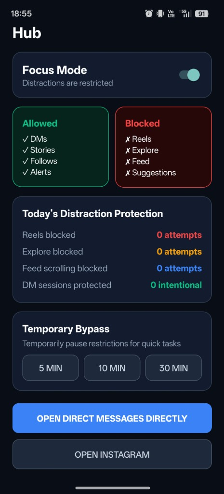
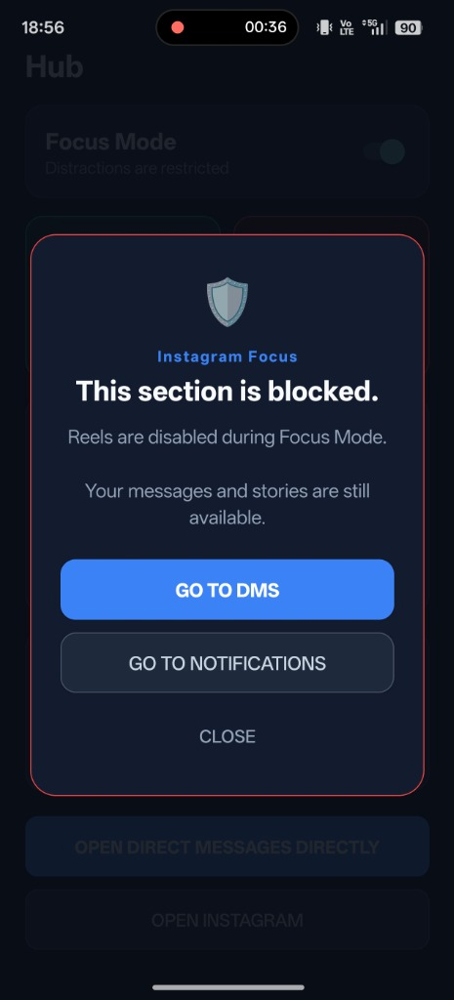
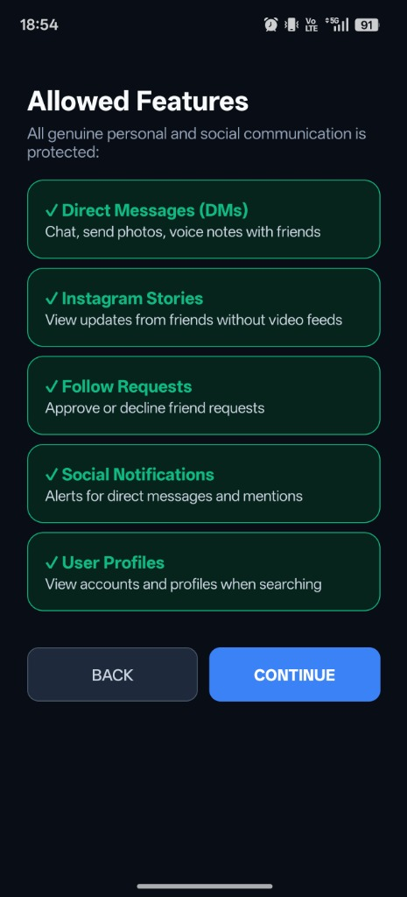
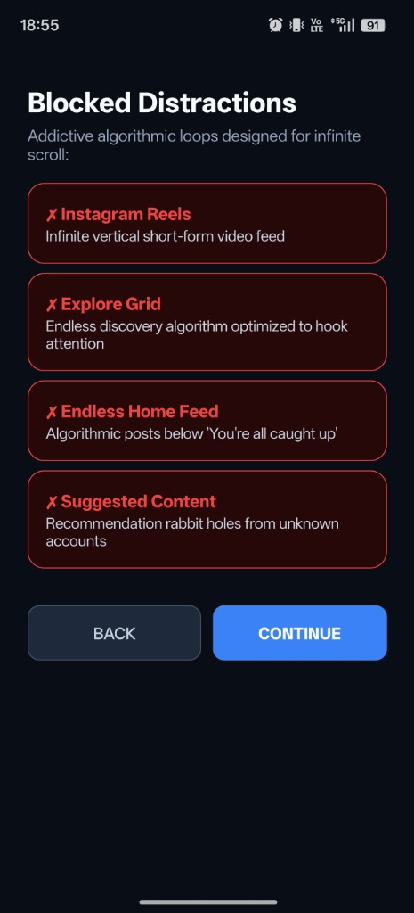
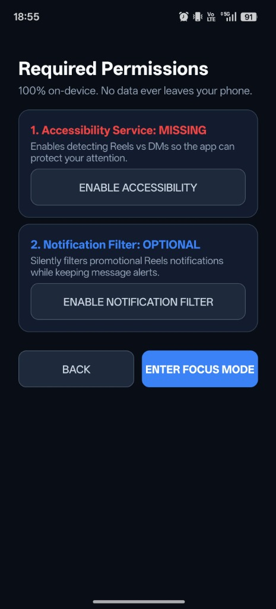

# Instagram Focus

[](https://developer.android.com)
[](https://kotlinlang.org)
[](#privacy-guarantee)
[](LICENSE)

> *"Instagram as a communication tool, not an entertainment app."*

**Instagram Focus** is a private, lightweight Android utility built to filter out the addictive surfaces of Instagram while preserving the useful social features.

It runs locally on your phone alongside the official Instagram app (`com.instagram.android`). It doesn't replace the app, hijack your session, or touch your account credentials. Instead, it uses Android's Accessibility framework to identify when an infinite-scrolling feed is active and steps in with a calm, non-punitive intervention screen.

<p align="center">
  
  &nbsp;&nbsp;&nbsp;&nbsp;
  
</p>

---

## Allowed vs. Blocked Surfaces

The app actively differentiates intentional social communication from algorithmic consumption loops:

<p align="center">
  
  &nbsp;&nbsp;&nbsp;&nbsp;
  
</p>

| ✅ Allowed (Communication) | ❌ Blocked (Algorithmic Traps) |
| :--- | :--- |
| **Direct Messages (DMs)** (Chats, Photos, Voice notes) | **Instagram Reels** (Endless vertical video feed) |
| **Instagram Stories** (Updates from people you follow) | **Explore Grid** (Algorithmic discovery rabbit holes) |
| **Follow Requests** (Approve or decline requests) | **Endless Feed Scrolling** (Posts below "You're all caught up") |
| **User Profiles** (Looking up specific accounts) | **Suggested Content** (Un-followed accounts & recommendations) |
| **Social Notifications** (DMs, mentions, follow requests) | **Promotional Alerts** (Reels push notifications) |

---

## How It Works Under the Hood

Instagram Focus is built around four core design principles:

1. **Intelligent Screen Classifier (`ScreenClassifier`)**: Rather than relying on fragile hard-coded text matches, the classifier evaluates multiple structural signals: view IDs (`clips_viewer_view_pager`, `explore_grid`, `feed_tab`), accessibility hierarchy nodes, and content descriptions.
2. **Safe Fallback Policy**: If a screen layout is ambiguous (e.g. after an Instagram UI update), the engine defaults to **ALLOW** (`ScreenType.UNKNOWN -> ALLOW`). Legitimate communication is never accidentally locked.
3. **Zero Invasive Permissions**: The app does **not** request `SYSTEM_ALERT_WINDOW` ("Draw over other apps"). The calm intervention screen (`InterventionActivity`) runs as a standard high-priority Android Activity with a translucent theme (`FLAG_ACTIVITY_NEW_TASK`).
4. **Battery-Conscious Performance**:
   - The Accessibility Service binds strictly to package `com.instagram.android`.
   - Node parsing is debounced at 120ms to prevent duplicate processing during fast flings.
   - Hierarchy traversal stops at depth 6.
   - Zero background polling timers. When Instagram is closed, CPU usage is zero.

---

## Getting Started

### 1. Installation

Download the pre-compiled, signed APK from the [Releases](https://github.com/sawan-ade/instagram-focus/releases) section:

- **[app-release.apk](app-release.apk)** (v1.0.0, 1.2 MB)

Transfer it to your phone via USB, WhatsApp, or Google Drive, and tap to install.

### 2. Permissions & Unlocking "Restricted Settings" (Android 13, 14, 15 & 16)

<p align="center">
  
</p>

On modern Android versions (including Realme UI, Pixel, Samsung One UI, and ColorOS), Android automatically greys out the Accessibility toggle for sideloaded apps as a security precaution. To unlock it:

1. Long-press the **Instagram Focus** icon on your home screen or app drawer and tap **App Info** (ⓘ).
2. Tap the **three vertical dots (⋮)** in the top-right corner.
3. Tap **"Allow restricted settings"** and confirm with your fingerprint or device PIN.
4. Go to **Settings $\rightarrow$ Accessibility $\rightarrow$ Downloaded apps $\rightarrow$ Instagram Focus** and toggle it **ON**.

---

## Core Controls & Features

* **Master Switch**: Toggle Focus Mode ON/OFF at any time. Turning it off displays an optional reflection prompt (*"Why are you pausing focus?"*) with an option to take a 10-minute break instead.
* **Temporary Bypass**: Quickly pause restrictions for `5 min`, `10 min`, or `30 min` when you need to check something specific. A live countdown shows when protection resumes.
* **Direct DM Launcher**: Tap `Open Direct Messages Directly` to deep-link directly into your inbox (`instagram://direct_inbox`), bypassing the feed entirely.
* **Distraction Protection Stats**: Track how many times you were saved from falling into Reels or Explore today.
* **Live Classifier Inspector**: A built-in diagnostic tool to test and simulate how the classifier categorizes different Instagram screen states in real time.

---

## Privacy Guarantee

This project was built for personal use with privacy as the primary architectural constraint:

- **No Internet Permission**: The app doesn't even declare `android.permission.INTERNET`. Not a single packet can leave your device.
- **No Account Access**: Never asks for your Instagram password, tokens, or cookies.
- **No Message Logging**: Accessibility node scanning only inspects layout IDs and container types. Private message contents are never read, copied, or stored.
- **Local SQLite Storage**: Aggregate distraction counters stay in an encrypted on-device database and can be cleared with one tap in Settings.

---

## ⚠️ Known Limitations & Engineering Trade-offs

### Why an External Filter Layer (and Not a Re-made Instagram Client)?
A frequent question is: *Why not simply build a custom, stripped-down Instagram app from scratch?*

1. **Meta's Closed Ecosystem & Private Protocol**: Meta does **not** provide a public API for personal user functionality (direct messages, viewing stories, or feed navigation). The official Instagram Graph API is strictly reserved for business marketing and creator analytics.
2. **Account Suspension & Ban Risk**: Developing an unofficial Instagram client requires reverse engineering private GraphQL/MQTT endpoints, spoofing mobile device signatures, and extracting session cookies. Meta's anti-fraud machine learning systems actively flag non-official client fingerprints, leading to phone verification checkpoints or permanent account bans.
3. **The Ban-Proof Compromise**: Operating as an external filter around the official Play Store app via Android's native Accessibility framework is the **only architecture that guarantees your account remains 100% safe from bans**, even though it brings the inherent constraints of an external observer.

---

### Inherent Technical Limitations

Operating outside the Instagram binary comes with specific real-world behaviors:

* **Brief Frame Glances (100–150ms Transient Delay)**:
  Because Instagram runs as an independent process, when you tap into Reels or Explore, Instagram draws its initial frame before Android broadcasts the accessibility window change event to our service. You may occasionally see a fraction-of-a-second flash of the video before the calm intervention screen appears over it. Eliminating this entirely would require root-level process hooks (like Xposed/LSPosed), which compromises Android system integrity.
* **UI Mutation & Server-Side A/B Tests**:
  Meta frequently updates Instagram's UI using dynamic server-side component frameworks (Litho, Bloks, and Jetpack Compose) with obfuscated resource hashes. While the `ScreenClassifier` uses multi-signal heuristic voting (view IDs, content descriptions, hierarchy depth, and child node shapes), brand-new UI variants tested by Instagram may occasionally cause a delay in detection until updated signatures are added.
* **Fail-Open Policy (Safe Fallback)**:
  By design, if the classifier cannot determine what screen you are on with at least 60% confidence, it classifies it as `UNKNOWN` and **allows** access. This is an intentional engineering choice: *it is far better for an occasional Reel to slip through than for the app to mistakenly lock you out of an urgent personal message or friend request.*
* **Aggressive OEM Battery Savers (Realme UI, ColorOS, HyperOS, MIUI)**:
  Heavily customized Android vendor skins frequently throttle or disconnect Accessibility Services when RAM is tight or after long screen-off intervals. If interventions stop appearing, ensure Instagram Focus has its battery settings set to **"Unrestricted"** and background auto-launch enabled in your phone's app settings.

---

## Building from Source

### Prerequisites
- JDK 17
- Android SDK Platform 34 & Build-Tools 34.0.0+
- Kotlin 1.9.23+

### Build via Gradle
```bash
git clone https://github.com/sawan-ade/instagram-focus.git
cd instagram-focus
./gradlew assembleRelease
```

### Running Unit Tests
```bash
./gradlew test
```
The test suite includes 23 unit tests covering screen classification heuristics, restriction rule evaluation, and bypass state timers:
```
OK (23 tests) - 0.089s
```

---

## License

MIT License — Built by [Sawan Ade](https://github.com/sawan-ade). Free for personal use and modification.
